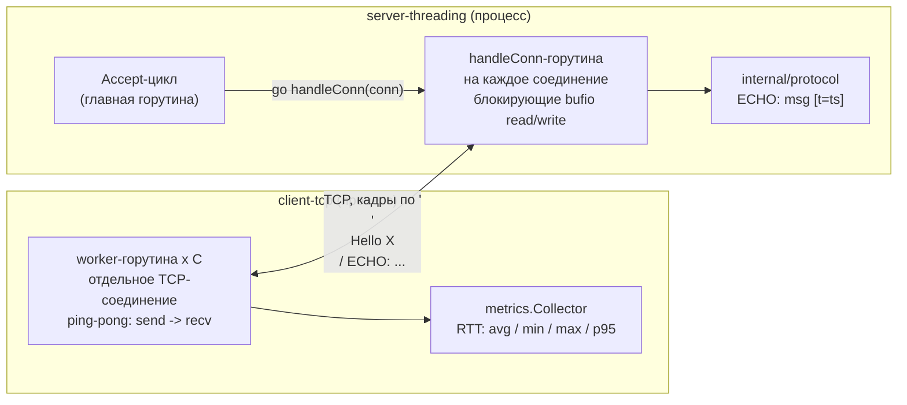
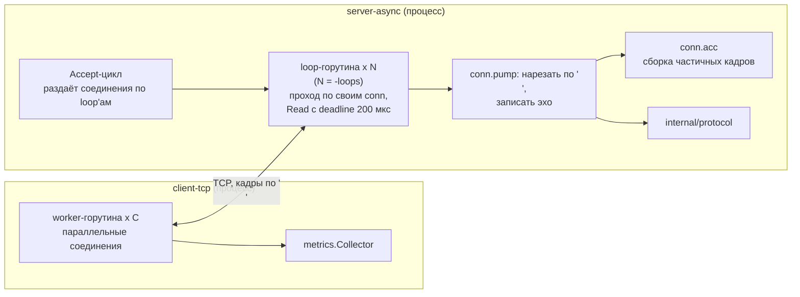
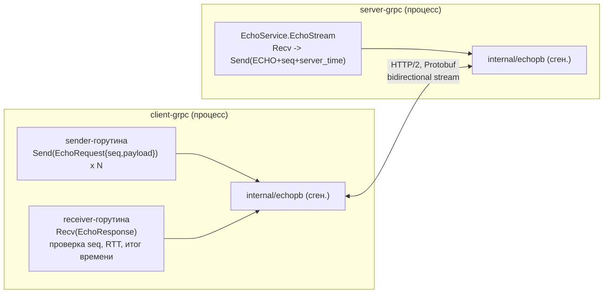
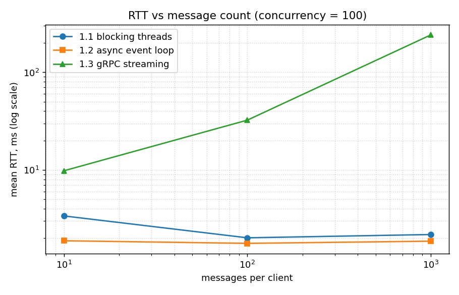
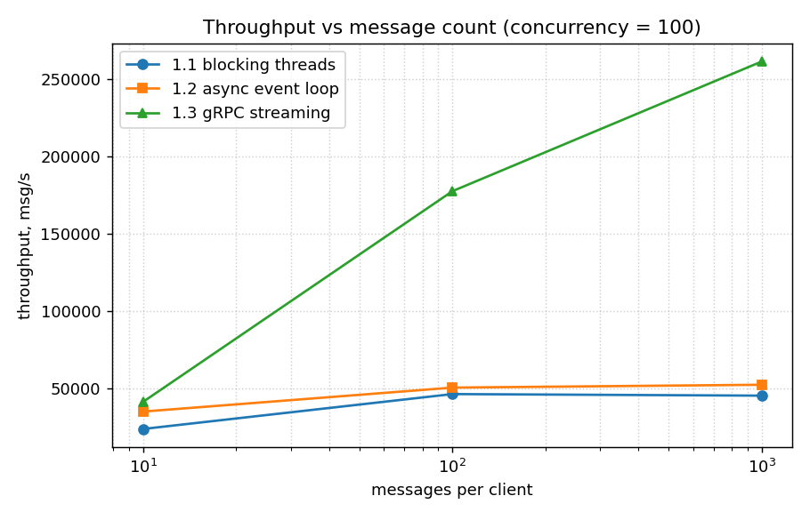
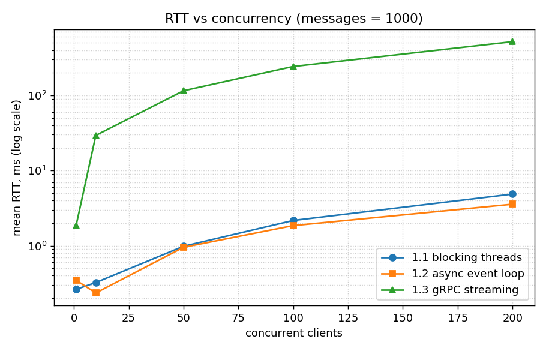
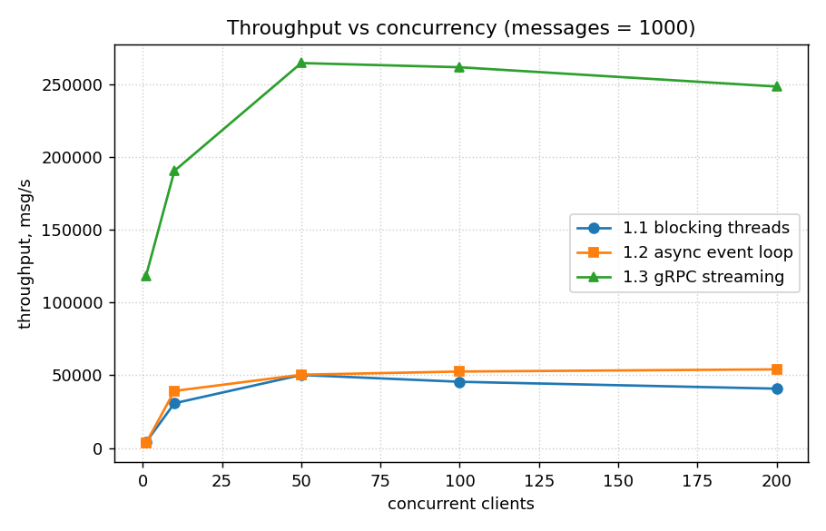

# Отчёт по лабораторной работе 1 - Эхо-сервер с разными моделями коммуникации

## 1. Цель и постановка задачи

Освоить три паттерна сетевого взаимодействия - блокирующий многопоточный TCP,
асинхронный ввод-вывод на событиях и потоковый RPC (gRPC) - реализовать в каждом
из них систему "Эхо" и сравнить подходы по задержке (RTT), пропускной способности
и потреблению ресурсов.

Система "Эхо": сервер принимает строку, возвращает её с префиксом `ECHO:` и
серверной временной меткой; клиент отправляет `N` сообщений `Hello X\n`
(X = 0, 1, 2, ...) и измеряет RTT каждого.

## 2. Реализация системы

Язык - **Go 1.25** (`go.mod` фиксирует версию; тулчейн подтягивается
автоматически). Один модуль `lab1`, отдельные исполняемые команды в `cmd/`,
переиспользуемый код в `internal/`.

| Часть | Сервер | Клиент | Порт по умолчанию |
|-------|--------|--------|-------------------|
| 1.1 Блокирующий многопоточный | `cmd/server-threading` | `cmd/client-tcp` | 9101 |
| 1.2 Асинхронный на событиях | `cmd/server-async` | `cmd/client-tcp` | 9102 |
| 1.3 Потоковый RPC | `cmd/server-grpc` | `cmd/client-grpc` | 9103 |
| 1.4 Сравнительный анализ | `cmd/benchmark` + `scripts/plot.py` | | |

### 2.1. Общий протокол для 1.1 и 1.2 (`internal/protocol`)

- **Запрос**: произвольная UTF-8-строка, завершается `\n`.
- **Ответ**: `ECHO: <сообщение> [t=<timestamp>]\n`, где `<timestamp>` - время
  сервера в секундах Unix с 6 знаками после запятой (`fmt.Sprintf("%.6f", ...)`,
  требование 1.5).
- Кадр ограничен 64 КБ; более длинный - протокольная ошибка (соединение
  закрывается).
- Обработка ошибок: дедлайны на чтение/запись, корректная реакция на `io.EOF`
  (обрыв), таймауты, некорректные ответы (проверка формата на клиенте).

Формат разобран юнит-тестами `internal/protocol/protocol_test.go`
(round-trip формата, граничные случаи).

### 2.2. Задание 1.1 - блокирующий многопоточный сервер

Классическая модель "горутина на соединение". Главная горутина крутит
`Accept()`; каждое принятое соединение обслуживается отдельной горутиной,
которая выполняет **блокирующие** `bufio.Reader.ReadString('\n')` и
`Write` на всё время жизни соединения. Go мультиплексирует горутины на
пул OS-потоков, поэтому это и есть "поток на соединение" с блокирующими
системными вызовами (требования 1.1, 1.2). Счётчик активных соединений
логируется каждые 2 с - им подтверждается работа при >= 100 параллельных
клиентах (требование 1.3).



**Инструменты**: стандартная библиотека `net`, `bufio`, `sync/atomic`,
`os/signal` (graceful shutdown).

### 2.3. Задание 1.2 - асинхронный сервер на событиях

Собственный реактор **только на стандартной библиотеке** (`net`). Фиксированный
пул из `-loops` горутин (по умолчанию = числу ядер) обслуживает все соединения;
горутина на соединение не создаётся, блокирующих вызовов в обработчике нет
(требования 2.1, 2.2). Цикл каждой loop-горутины:

1. забрать из канала вновь принятые соединения (неблокирующе);
2. пройти по своим соединениям, на каждом - одно чтение с коротким read
   deadline (`SetReadDeadline(now + 200 мкс)`): если данные уже есть, `Read`
   возвращает их сразу; если нет - таймаут, соединение не блокирует пул;
3. из накопленных байт вырезать полные строки (сборка частичных кадров в
   per-connection буфере) и записать эхо-ответы;
4. если весь проход не дал данных - короткий сон с нарастанием (0.25...2 мс),
   иначе сразу следующий проход.

Протокол и формат ответа те же, что в 1.1 (общий пакет `internal/protocol`,
требование 2.4). Плата за отказ от `epoll` - до ~200 мкс лишней задержки на
простаивающем соединении и небольшой фоновый CPU; под нагрузкой (данные есть
почти всегда) deadline не срабатывает.



**Инструменты**: стандартная библиотека `net`, `bytes`, `sync`, `os/signal`.

### 2.4. Задание 1.3 - потоковый RPC-сервер (gRPC)

Контракт `proto/echo.proto`, сериализация - Protobuf (бинарь, требование 3.3).
Один метод - **двунаправленный поток** (требование 3.2):

```proto
service EchoService {
  rpc EchoStream(stream EchoRequest) returns (stream EchoResponse);
}
message EchoRequest  { uint64 seq = 1; string payload = 2; }
message EchoResponse { uint64 seq = 1; string payload = 2;
                       google.protobuf.Timestamp server_time = 3; }
```

- `seq` - порядковый номер клиента, сервер возвращает его без изменений
  (порядок сообщений, требование 3.5);
- `server_time` - серверная метка времени **отдельным структурным полем**, не
  текстом (требование 3.4);
- код на обеих сторонах - сгенерированный из контракта (`internal/echopb`,
  `buf generate`, требования 3.6, 3.7);
- клиент открывает поток, отдельная горутина отправляет `N` запросов, основная
  читает ответы, проверяет порядок `seq` и считает общее время потоковой
  операции (требования 3.8, 3.9).



**Инструменты**: `google.golang.org/grpc`, `google.golang.org/protobuf`,
`buf` + `protoc-gen-go` + `protoc-gen-go-grpc` (кодогенерация).

### 2.5. Внешние библиотеки

Используется по возможности только стандартная библиотека Go. Единственные
прямые зависимости - gRPC и Protobuf; они обязательны по условию Задания 1.3
(RPC-фреймворк + `.proto` + сгенерированный код).

| Библиотека | Назначение |
|------------|------------|
| `google.golang.org/grpc` | gRPC-транспорт (HTTP/2) для 1.3 |
| `google.golang.org/protobuf` | бинарная сериализация Protobuf + `Timestamp` |

Транзитивно с ними: `golang.org/x/{net,sys,text}`, `genproto`. Кодогенерация
(`buf`, `protoc-gen-go`, `protoc-gen-go-grpc`) и графики (Python `matplotlib`) в
бинарники не входят.

Стандартной библиотекой вместо сторонних пакетов сделаны: событийный сервер 1.2
(реактор на `net`), замер CPU/RSS (`internal/procstat` - `GetProcessTimes` +
`GetProcessMemoryInfo` через `syscall` на Windows, `/proc` на Linux),
высокоточный таймер (`internal/hrtime` - `QueryPerformanceCounter`).

## 3. Методология тестирования

### 3.1. Условия

| Параметр | Значение |
|----------|----------|
| ОС | Windows 11 Pro 10.0.26200 |
| CPU | Intel Core i7-8550U @ 1.80 ГГц, 4 ядра / 8 потоков |
| RAM | 16 ГБ |
| Сеть | loopback (`127.0.0.1`), без физической сети |
| Go | 1.25 (`windows/amd64`) |
| async-сервер 1.2 | `-loops 8` (реактор на стандартном `net`) |
| gRPC | v1.83.2, без TLS |

### 3.2. Параметры прогонов

- **Сообщений на клиента**: 10, 100, 1000 (требование 4.1).
- **Параллельных клиентов**: 1, 10, 50, 100, 200 для всех подходов; плюс
  отдельный прогон **500** клиентов для асинхронного сервера (требования 2.3,
  2.7, 4.5). По договорённости верхняя граница сетки - 200 клиентов.
- Каждая ячейка сетки прогоняется **3 раза**, в отчёте - среднее по повторам.
  Перед каждым подходом - один "прогревочный" прогон (отбрасывается).
- Оркестратор `cmd/benchmark` для каждого подхода поднимает сервер отдельным
  процессом, дожидается готовности порта, прогоняет сетку и снимает метрики.
  Сырые данные - `results/raw/bench-*.csv`, сводные - `results/summary.csv`.

### 3.3. Как измерялся RTT

Для TCP-клиента (1.1/1.2) - строгий ping-pong на каждом соединении: засекается
момент **перед** `Write`, затем `ReadString('\n')`, момент **сразу после**
получения ответа; `RTT = t1 - t0`. Для gRPC (1.3) - время от `Send(seq)` до
`Recv(seq)` на одном потоке; поскольку отправитель и получатель работают
параллельно и поток конвейеризуется, эта величина включает время ожидания в
очереди потока (см. п. 5). Основная метрика 1.3 по требованию 3.9 - **общее
время потоковой операции**.

**Высокоточный таймер.** На используемой машине монотонный таймер Go
(`time.Now()` / `time.Since`) имеет гранулярность ~ 0.5-0.6 мс, что грубее
измеряемых RTT и квантует их в ноль. Поэтому реализован пакет `internal/hrtime`:
на Windows он читает `QueryPerformanceCounter` напрямую (~ 100 нс), на прочих ОС
использует уже высокоточный `time` из стандартной библиотеки. Это аналог
`System.nanoTime()` из методички. С ним минимальный измеренный RTT на loopback -
~ 55-110 мкс (реалистично).

### 3.4. Как измерялись throughput, CPU и память

- **Throughput** = число сообщений / общее время фазы обмена (соединения
  устанавливаются до старта таймера, чтобы не учитывать TCP-хендшейки).
- **CPU и RSS сервера** - пакет `internal/procstat` (системные вызовы напрямую:
  `GetProcessTimes` + `GetProcessMemoryInfo` на Windows, `/proc/<pid>` на Linux).
  Отдельная горутина опрашивает процесс сервера каждые 50 мс; CPU% считается по
  приращению суммарного процессорного времени между замерами, в отчёте - пик.
  CPU в процентах от одного ядра (до 800 % на 8 потоках).
- Для очень коротких ячеек (10-100 сообщений при малой параллельности) прогон
  завершается быстрее одного интервала опроса, поэтому CPU там может быть 0 -
  показательны ячейки с 1000 сообщений и/или высокой параллельностью.

## 4. Результаты (Задания 1.1-1.3)

Значения - среднее по 3 повторам. RTT в миллисекундах.
`total, ms` - общее время фазы обмена; `throughput` - сообщений/с.

Процессор i7-8550U (15 Вт) заметно троттлит, поэтому абсолютные числа плавают
между прогонами (десятки процентов); значим относительный порядок подходов, а не
конкретные миллисекунды.

### 4.1. Задание 1.1 - блокирующий многопоточный

| msgs | clients | RTT mean | RTT p95 | RTT min | RTT max | throughput | total, ms | CPU peak % | RSS peak MB |
|---:|---:|---:|---:|---:|---:|---:|---:|---:|---:|
| 10 | 1 | 0.195 | 0.252 | 0.144 | 0.25 | 4 864 | 2.1 | 0 | 9 |
| 10 | 10 | 0.683 | 1.580 | 0.168 | 2.77 | 12 259 | 8.7 | 0 | 11 |
| 10 | 50 | 2.014 | 6.133 | 0.145 | 13.81 | 17 195 | 36.3 | 21 | 17 |
| 10 | 100 | 3.366 | 8.428 | 0.146 | 11.61 | 23 925 | 44.5 | 137 | 28 |
| 10 | 200 | 3.753 | 7.221 | 0.099 | 17.90 | 36 976 | 54.4 | 257 | 42 |
| 100 | 1 | 0.274 | 0.342 | 0.162 | 0.40 | 3 563 | 28.2 | 0 | 49 |
| 100 | 10 | 0.472 | 0.741 | 0.122 | 2.56 | 20 563 | 49.9 | 323 | 49 |
| 100 | 50 | 1.028 | 1.878 | 0.074 | 6.83 | 46 154 | 110.1 | 309 | 56 |
| 100 | 100 | 2.008 | 3.781 | 0.075 | 13.45 | 46 487 | 216.3 | 433 | 39 |
| 100 | 200 | 4.448 | 7.203 | 0.095 | 27.26 | 42 151 | 475.5 | 605 | 55 |
| 1000 | 1 | 0.263 | 0.395 | 0.099 | 2.35 | 3 849 | 269.3 | 94 | 57 |
| 1000 | 10 | 0.324 | 0.621 | 0.071 | 3.26 | 30 725 | 329.5 | 398 | 60 |
| 1000 | 50 | 0.985 | 1.574 | 0.063 | 34.46 | 50 148 | 999.8 | 642 | 43 |
| 1000 | 100 | 2.169 | 3.510 | 0.073 | 45.07 | 45 472 | 2 208.9 | 705 | 42 |
| 1000 | 200 | 4.867 | 8.088 | 0.073 | 100.31 | 40 737 | 4 911.0 | 699 | 63 |

### 4.2. Задание 1.2 - асинхронный на событиях

| msgs | clients | RTT mean | RTT p95 | RTT min | RTT max | throughput | total, ms | CPU peak % | RSS peak MB |
|---:|---:|---:|---:|---:|---:|---:|---:|---:|---:|
| 10 | 1 | 0.369 | 1.424 | 0.172 | 1.42 | 2 607 | 3.9 | 42 | 9 |
| 10 | 10 | 0.940 | 3.492 | 0.175 | 6.85 | 11 131 | 12.5 | 52 | 9 |
| 10 | 50 | 1.844 | 4.421 | 0.176 | 7.68 | 19 289 | 27.7 | 83 | 12 |
| 10 | 100 | 1.872 | 3.343 | 0.121 | 7.98 | 35 171 | 28.5 | 156 | 14 |
| 10 | 200 | 4.360 | 8.835 | 0.243 | 16.49 | 29 261 | 68.8 | 286 | 16 |
| 100 | 1 | 0.295 | 0.384 | 0.128 | 1.39 | 3 310 | 30.4 | 42 | 17 |
| 100 | 10 | 0.454 | 0.903 | 0.102 | 2.92 | 20 352 | 49.9 | 231 | 17 |
| 100 | 50 | 1.022 | 2.212 | 0.071 | 7.52 | 44 166 | 114.4 | 361 | 17 |
| 100 | 100 | 1.761 | 2.959 | 0.090 | 10.95 | 50 667 | 198.7 | 526 | 18 |
| 100 | 200 | 3.416 | 6.567 | 0.111 | 34.43 | 50 522 | 402.3 | 481 | 18 |
| **100** | **500** | **9.152** | **16.403** | **0.077** | **78.22** | **46 422** | **1 083.3** | **592** | **28** |
| 1000 | 1 | 0.348 | 0.562 | 0.104 | 18.85 | 3 262 | 355.9 | 115 | 18 |
| 1000 | 10 | 0.236 | 0.559 | 0.048 | 3.59 | 39 172 | 255.4 | 489 | 18 |
| 1000 | 50 | 0.954 | 1.482 | 0.072 | 27.37 | 50 321 | 1 000.4 | 752 | 18 |
| 1000 | 100 | 1.853 | 3.205 | 0.071 | 22.92 | 52 512 | 1 915.6 | 716 | 18 |
| 1000 | 200 | 3.570 | 5.989 | 0.070 | 48.49 | 54 005 | 3 712.9 | 745 | 19 |

Прогон **500 одновременных клиентов** (требования 2.3 / 2.7 / 4.5) выполнен
успешно: средний RTT 9.2 мс, p95 16.4 мс, throughput ~ 46 тыс. сообщений/с,
пиковый RSS сервера всего 28 МБ (реактор не держит стек на соединение).

### 4.3. Задание 1.3 - потоковый RPC (gRPC)

| msgs | streams | RTT mean | RTT p95 | RTT min | RTT max | throughput | total, ms | CPU peak % | RSS peak MB |
|---:|---:|---:|---:|---:|---:|---:|---:|---:|---:|
| 10 | 1 | 1.582 | 1.984 | 1.535 | 1.98 | 1 220 | 8.2 | 0 | 13 |
| 10 | 10 | 1.732 | 2.435 | 1.021 | 2.94 | 12 214 | 8.2 | 0 | 13 |
| 10 | 50 | 7.417 | 8.636 | 5.126 | 10.82 | 26 418 | 19.8 | 21 | 16 |
| 10 | 100 | 9.772 | 12.791 | 6.795 | 15.46 | 41 460 | 24.3 | 41 | 18 |
| 10 | 200 | 10.091 | 12.183 | 7.620 | 15.24 | 95 730 | 21.0 | 0 | 18 |
| 100 | 1 | 1.911 | 2.118 | 1.624 | 2.39 | 8 157 | 12.3 | 10 | 18 |
| 100 | 10 | 7.843 | 9.383 | 5.152 | 10.56 | 49 589 | 20.3 | 21 | 18 |
| 100 | 50 | 29.685 | 35.715 | 19.682 | 38.40 | 97 698 | 52.1 | 208 | 19 |
| 100 | 100 | 32.338 | 40.005 | 11.330 | 46.88 | 177 674 | 56.9 | 124 | 20 |
| 100 | 200 | 81.097 | 100.049 | 28.748 | 110.23 | 182 474 | 122.7 | 216 | 25 |
| 1000 | 1 | 1.856 | 2.232 | 1.394 | 2.26 | 117 879 | 8.5 | 0 | 27 |
| 1000 | 10 | 29.357 | 36.980 | 10.590 | 39.95 | 190 370 | 54.8 | 196 | 22 |
| 1000 | 50 | 115.283 | 139.879 | 60.497 | 153.09 | 264 404 | 189.2 | 636 | 29 |
| 1000 | 100 | 242.208 | 291.403 | 122.087 | 335.33 | 261 529 | 382.7 | 552 | 44 |
| 1000 | 200 | 517.753 | 616.552 | 241.777 | 736.79 | 248 272 | 807.4 | 588 | 82 |

> Для gRPC "RTT" - это задержка сообщения в конвейере потока (отправитель
> уходит вперёд получателя), поэтому она растёт с числом сообщений и потоков.
> Честная метрика подхода - `total, ms` и throughput.

### 4.4. Графики (требование 5.2)

Построены `scripts/plot.py` из `results/summary.csv`.

**RTT от числа сообщений** (100 параллельных клиентов, лог. шкала Y):



**Throughput от числа сообщений** (100 параллельных клиентов):



Дополнительно - зависимость от числа клиентов при 1000 сообщениях:




## 5. Сравнительный анализ (Задание 1.4)

### 5.1. Сводка при 1000 сообщений на клиента

| Клиентов | Общее время, мс - 1.1 / 1.2 / 1.3 | Throughput, сообщ./с - 1.1 / 1.2 / 1.3 |
|---:|---|---|
| 1 | 269 / 356 / **9** | 3.8 тыс / 3.3 тыс / **118 тыс** |
| 10 | 330 / 255 / **55** | 31 тыс / 39 тыс / **190 тыс** |
| 50 | 1 000 / 1 000 / **189** | 50 тыс / 50 тыс / **264 тыс** |
| 100 | 2 209 / 1 916 / **383** | 45 тыс / 53 тыс / **262 тыс** |
| 200 | 4 911 / 3 713 / **807** | 41 тыс / 54 тыс / **248 тыс** |

### 5.2. Задержка (RTT одного сообщения, ping-pong)

- **При малой нагрузке блокирующий 1.1 быстрее событийного 1.2**: 1.1 держит
  средний RTT ~ 0.2-0.3 мс, 1.2 - ~ 0.3-0.4 мс. Причина - реактор 1.2 без
  `epoll` опрашивает соединения с коротким read deadline (200 мкс), и при одном
  клиенте этот такт целиком ложится в каждый round-trip. Это осознанная плата за
  отказ от сторонней библиотеки: чистый `net` не даёт уведомлений о готовности.
- **Под нагрузкой (50+ клиентов) 1.1 и 1.2 по RTT сходятся** (~ 1-5 мс, растёт с
  параллельностью) - здесь узкое место общее: конкуренция за CPU и планировщик.
  У 1.2 deadline почти не срабатывает, потому что данные в сокетах есть почти
  всегда.
- **gRPC даёт малый RTT только при одном потоке** (~ 1.5-2 мс - накладные
  расходы Protobuf и HTTP/2). При конвейеризации потока "RTT" отдельного
  сообщения быстро растёт (десятки-сотни мс): сообщение ждёт в очереди потока.

### 5.3. Пропускная способность

- **1.1 и 1.2 упираются в ~ 40-55 тыс. сообщений/с**: клиент делает строгий
  ping-pong (одно сообщение в полёте на соединение), поэтому потолок задаёт RTT
  и число ядер, а не сервер. Под высокой параллельностью **1.2 немного обгоняет
  1.1** (54 против 41 тыс./с при 200 клиентах, общее время 3.7 против 4.9 с):
  фиксированный пул горутин создаёт меньше нагрузки на планировщик, а один
  проход реактора обрабатывает пачку готовых соединений.
- **gRPC - в 4-5 раз выше (250-265 тыс. сообщений/с)**: на одном потоке в полёте
  сразу много сообщений (конвейер HTTP/2), пара "сериализация+отправка"
  амортизируется по множеству сообщений. Общее время на 200 000 сообщений:
  gRPC ~ 0.8 с против ~ 3.7-4.9 с у TCP-подходов.

### 5.4. Ресурсы

- **Память - главное отличие 1.1 и 1.2.** Блокирующий сервер держит горутину со
  стеком на каждое соединение: RSS растёт с числом клиентов (~ 40-63 МБ при
  100-200). Событийный сервер держит фиксированный пул горутин, поэтому его
  **RSS почти не зависит от нагрузки: ~ 17-19 МБ на всей сетке, 28 МБ даже при
  500 клиентах** - в 2-3 раза меньше, и константа. На масштабе C10k+ разрыв стал
  бы кратным. gRPC - 18-82 МБ (буферы потоков и HTTP/2).
- **CPU**: под нагрузкой все три подхода используют почти все ядра (пики
  ~ 600-750 % из 800 %). Реактор 1.2 при простое тратит немного CPU на опрос
  (видно по ненулевому CPU в лёгких ячейках), но под нагрузкой это теряется на
  фоне полезной работы.

### 5.5. Когда какой подход эффективнее

| Сценарий | Рекомендация |
|----------|--------------|
| Простой текстовый протокол, десятки-сотни клиентов, важна минимальная задержка ответа, минимум зависимостей | **1.1 Блокирующий многопоточный.** Самый простой код, предсказуемая задержка. В Go отлично масштабируется благодаря дешёвым горутинам и встроенному poller. |
| Тысячи-десятки тысяч преимущественно простаивающих соединений (чат, push, long-poll), ограниченная память | **1.2 Асинхронный на событиях.** Нет стека на соединение, фиксированный пул обслуживает всех, RSS - константа. Для промышленного C10k брать `epoll`/`kqueue` (через библиотеку или `x/sys`), а не опрос по deadline. |
| Внутрисервисное взаимодействие, потоковая передача, строгий контракт и типы, высокая пропускная способность, многоязычность | **1.3 Потоковый gRPC.** Бинарная сериализация, кодогенерация, конвейеризация дают максимум сообщений/с; цена - задержка отдельного сообщения под нагрузкой и сложность инфраструктуры. |

### 5.6. Ограничения каждого подхода

- **1.1**: стек (обычно >= 8 КБ) и планирование на каждое соединение; на очень
  большом числе соединений - рост памяти и накладных расходов планировщика;
  в языках с OS-потоками (не Go) модель ломается уже на тысячах клиентов.
- **1.2**: сложнее код (машина состояний, сборка частичных кадров); одна
  "тяжёлая" операция в цикле задержит все его соединения; без `epoll` опрос по
  deadline добавляет задержку простаивающим соединениям и фоновый CPU - на
  Linux честнее взять `epoll` напрямую.
- **1.3**: обязательны контракт `.proto` и кодогенерация; бинарь не читается
  "глазами"; накладные расходы HTTP/2+Protobuf проигрывают на единичных
  запросах; под нагрузкой конвейер раздувает задержку отдельного сообщения;
  тяжёлая зависимость.

### 5.7. Факторы, влияющие на производительность

Число одновременных клиентов и число сообщений в полёте (конвейер vs ping-pong);
число ядер CPU и работа планировщика; стоимость сериализации (текст vs
Protobuf) и фрейминга (строки vs HTTP/2); размер и число буферов, `TCP_NODELAY`;
разрешение таймера при измерениях (см. `internal/hrtime`); механизм мультиплекса
для событийной модели (опрос по deadline против нативного `epoll`/`kqueue`);
тепловой троттлинг CPU (i7-8550U, 15 Вт); RTT канала (здесь loopback, поэтому
виден в основном CPU-bound режим).

## 6. Выводы

1. **Событийная модель 1.2 экономит память и слегка выигрывает throughput под
   нагрузкой, ценой задержки при простое.** RSS событийного сервера - константа
   ~ 17-19 МБ независимо от числа клиентов (28 МБ при 500), у блокирующего -
   40-63 МБ и растёт. При 200 клиентах 1.2 быстрее 1.1 (3.7 против 4.9 с). Но при
   1 клиенте 1.2 медленнее: реактор на чистом `net` опрашивает сокеты по
   таймауту, без `epoll`-уведомлений.
2. **Потоковый gRPC кратно выигрывает по пропускной способности** (в 4-5 раз) за
   счёт конвейеризации и бинарной сериализации, но проигрывает по задержке
   отдельного сообщения под нагрузкой и требует контракта и кодогенерации.
3. Выбор подхода определяется сценарием: минимальная задержка и простота - 1.1;
   массовые простаивающие соединения и память - 1.2; внутрисервисные потоки и
   максимум throughput - 1.3 (см. таблицу 5.5).
4. Корректное измерение суб-миллисекундных RTT на Windows потребовало
   высокоточного таймера (`QueryPerformanceCounter`); стандартного
   `time.Now()` (~ 0.5 мс) недостаточно.

## 7. Соответствие требованиям

| Треб. | Где реализовано |
|------|-----------------|
| 1.1 блокирующие вызовы чтения/записи | `cmd/server-threading` - `bufio.ReadString` / `Write` |
| 1.2 поток на соединение | `go s.handleConn(conn)` |
| 1.3 >= 100 соединений | прогоны c=100, c=200; лог счётчика активных |
| 1.4 чтение до `\n` | `reader.ReadString('\n')` |
| 1.5 формат `ECHO: ... [t=...]`, ts 6 знаков | `internal/protocol.BuildResponse` / `FormatTimestamp` |
| 1.6 клиент по TCP | `cmd/client-tcp` (`net.Dialer`) |
| 1.7 `Hello X\n`, X = 0,1,2... | `driveConn`: `fmt.Sprintf("Hello %d\n", i)` |
| 1.8 RTT send->recv на сообщение | `hrtime.Now()` до `Write` и после `ReadString` |
| 1.9 статистика после всех запросов | `metrics.Summary.String()` (avg/min/max/p95/throughput) |
| 1.10 корректное закрытие | `defer closeAll(conns)` |
| 2.1 неблокирующий I/O / события | `cmd/server-async` - реактор на `net`, чтения с коротким deadline |
| 2.2 один/ограниченное число потоков | `-loops` event-loop-горутин, без горутины на соединение |
| 2.3 >= 500 соединений | прогон async c=500 |
| 2.4 тот же протокол | общий `internal/protocol` |
| 2.5 клиент не блокирует основной поток | `C` горутин-клиентов, main лишь ждёт `WaitGroup` |
| 2.6 параллельные запросы | флаг `-concurrency` |
| 2.7 замер при 500 клиентах | прогон async c=500 в `results/summary.csv` |
| 3.1 RPC с потоковой передачей | gRPC |
| 3.2 потоковый метод | `EchoStream` (bidirectional) |
| 3.3 бинарная сериализация | Protobuf |
| 3.4 серверная метка времени полем | `EchoResponse.server_time` (`google.protobuf.Timestamp`) |
| 3.5 порядок сообщений (seq) | поле `seq`, сервер возвращает, клиент проверяет |
| 3.6 контракт в файле | `proto/echo.proto` |
| 3.7 сгенерированный код | `internal/echopb`, используется сервером и клиентом |
| 3.8 поток 100+ сообщений | прогоны m=100, m=1000 |
| 3.9 общее время потоковой операции | `elapsed` в `client-grpc` (`hrtime`) |
| 4.1 10/100/1000 сообщений | сетка `cmd/benchmark` |
| 4.2 RTT avg/min/max/p95, высокоточный таймер | `internal/metrics` + `internal/hrtime` |
| 4.3 throughput сообщений/с | `metrics.Summary.Throughput` |
| 4.4 CPU и память | `internal/procstat` (syscall: GetProcessTimes / GetProcessMemoryInfo, /proc), колонки в CSV |
| 4.5 500 клиентов для async | прогон async c=500 |
| 5.1 таблицы | разделы 4 и 5 |
| 5.2 >= 2 графиков | `results/*.png` (4 графика) |
| 5.3 выводы с ответами на вопросы | разделы 5.5-5.7, 6 |
| Общие: раздельные модули, независимый запуск, обработка ошибок, комментарии, документация API, логирование | `cmd/*` - 6 отдельных программ; дедлайны и обработка `EOF`/таймаутов; doc-комментарии пакетов; `proto` + `README.md`; `log` ключевых событий |

## 8. Структура проекта (для Задания 1.4)

```
Lab1/
  PLAN.md / REPORT.md / README.md
  go.mod / go.sum
  proto/echo.proto            контракт gRPC
  buf.yaml / buf.gen.yaml     кодогенерация без protoc
  internal/
    protocol/                 текстовый протокол ECHO (+ тесты)
    metrics/                  RTT-статистика avg/min/max/p95, throughput (+ тесты)
    hrtime/                   высокоточный монотонный таймер (QPC на Windows)
    procstat/                 семплер CPU/RSS процесса сервера
    echopb/                   сгенерированный код gRPC
  cmd/
    server-threading/         1.1 - блокирующий многопоточный
    server-async/             1.2 - событийный (реактор на net)
    server-grpc/              1.3 - потоковый gRPC
    client-tcp/               клиент для 1.1 и 1.2
    client-grpc/              клиент для 1.3
    benchmark/                1.4 - оркестратор прогонов
  scripts/
    build.ps1 / kill-servers.ps1 / all.ps1
    plot.py + requirements.txt
  results/
    raw/*.csv                 сырые замеры
    summary.csv               сводная таблица
    logs/*.log                вывод серверов
    *.png                     графики
```

## 9. Как воспроизвести

```
# Сборка (Windows)
powershell -File scripts/build.ps1

# Юнит-тесты
go test ./...

# Полный прогон измерений + графики
powershell -File scripts/all.ps1
#   или вручную:
bin/benchmark -bin bin -out results -messages 10,100,1000 -concurrency 1,10,50,100,200
python scripts/plot.py
```

Отдельный запуск серверов и клиентов - см. `README.md`.
